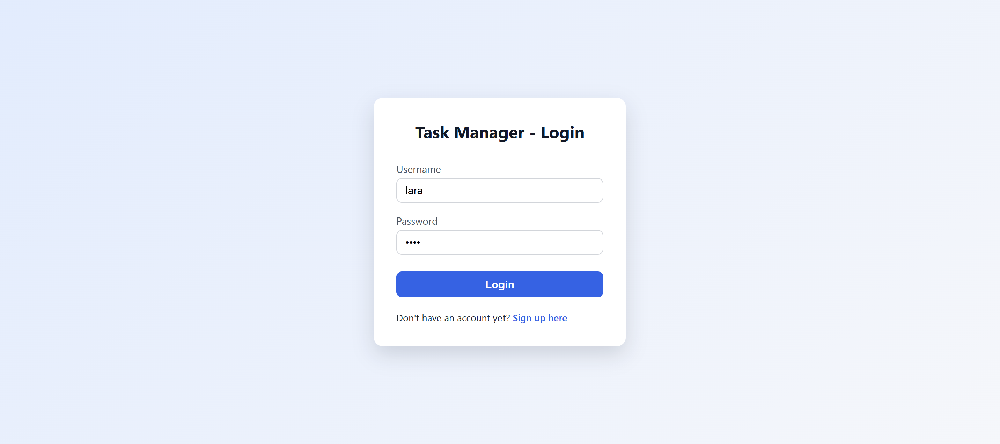
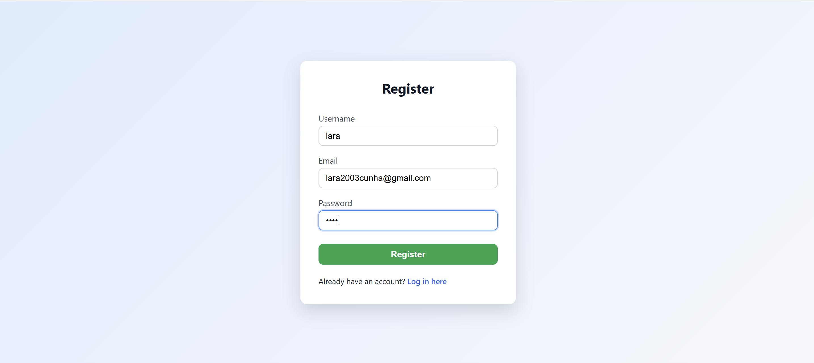
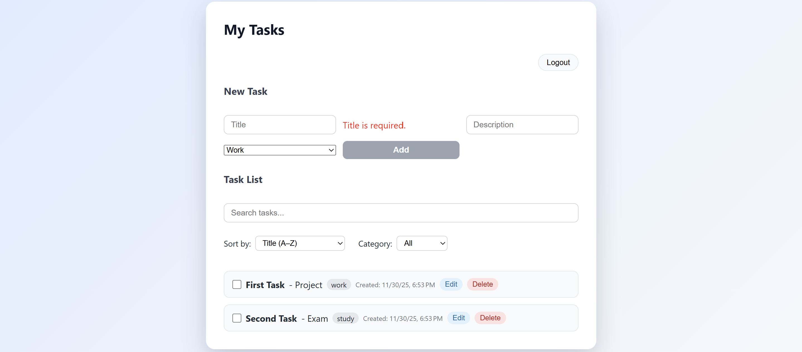

# Task Manager — Flask REST API + Angular Frontend

Task Manager is a simple task management application developed as a technical exercise.

It allows users to:
- Create an account and log in
- Create, list, edit and delete tasks
- Mark tasks as completed
- Log out
- Access only their own tasks

---

## Features

- User registration and login with JWT authentication
- Personal task list (each user only sees their own tasks)
- Create, edit, delete tasks
- Mark tasks as completed
- Task categories: Work, Study, Personal, Other
- Search tasks by title/description
- Filter tasks by category
- Sort tasks by date, title, or status (pending/completed)
- Creation and completion timestamps for tasks
- Logout and token-based protection for private routes

---

## Technologies Used

### Backend (Python)
- Flask
- Flask SQLAlchemy (ORM)
- Flask-JWT-Extended (JWT authentication)
- Flask-Bcrypt (password hashing)
- Flask-CORS
- SQLite (local database)

### Frontend (Angular)
- Angular 17 (Standalone Components)
- TypeScript
- Angular Router
- HttpClient
- FormsModule

---

## Project Structure

```
task-manager-flask-angular/
│
├── backend/
│   ├── app.py
│   ├── models.py
│   ├── extensions.py
│   ├── requirements.txt
│   ├── tests/
│   │   ├── conftest.py
│   │   ├── test_auth.py
│   │   └── test_tasks.py
│   └── instance/ (database created automatically)
│
└── frontend/
    ├── src/app/
    │   ├── auth/
    │   │   ├── login/
    │   │   └── register/
    │   ├── tasks/
    │   │   └── task-list/
    │   ├── guards/
    │   ├── app.routes.ts
    │   └── app.config.ts
    └── package.json
```

---

## Prerequisites

- Python 3.8+  
- Node.js 18+ and npm  
- Angular CLI (optional, but recommended):  
  ```bash
  npm install -g @angular/cli


## Running the Backend (Flask)

Open a terminal and navigate to the backend folder:

```bash
cd backend
```

(Optional) Create a virtual environment:

```bash
python -m venv venv
source venv/bin/activate         # Linux/WSL/Mac
# venv\Scripts\activate          # Windows PowerShell
```

Install dependencies:

```bash
pip install -r requirements.txt
```

(Optional) Set JWT secret:

```bash
export JWT_SECRET_KEY="change-me"     # Linux/WSL
# $env:JWT_SECRET_KEY="change-me"     # Windows PowerShell
```

Start the API:

```bash
python app.py
```

Backend available at:

```
http://127.0.0.1:5000
```

---

## Running the Frontend (Angular)

Open **another terminal**:

```bash
cd frontend
```

Install dependencies:

```bash
npm install
```

Start the application:

```bash
ng serve
```

Frontend available at:

```
http://localhost:4200
```

---

## Authentication

After login, the backend returns a **JWT access token**, stored in `localStorage`.

All `/tasks` routes require:

```
Authorization: Bearer <token>
```

Each task is linked to a `user_id`, ensuring users can only view or modify their own tasks.

---

## Main API Endpoints

### Authentication
| Method | Route | Description |
|--------|-------|-------------|
| POST | `/register` | Create a new user |
| POST | `/login` | Authenticate and receive JWT |

### Tasks (private)
| Method | Route | Description |
|--------|-------|-------------|
| GET | `/tasks` | List user's tasks |
| POST | `/tasks` | Create a new task |
| PUT | `/tasks/<id>` | Update an existing task |
| DELETE | `/tasks/<id>` | Delete a task |

---

## Test Credentials

```
username: lara
password: 1234
```

Or create an account through the **Register** page.

---

## Running Backend Tests (pytest)

The backend includes automated tests for authentication and task management.

From the project root:

```bash
cd backend
python -m venv venv
source venv/bin/activate         # Linux/WSL/Mac
# venv\Scripts\activate          # Windows PowerShell

pip install -r requirements.txt
cd ..
``` 

Then run the tests from the project root:

```bash

source backend/venv/bin/activate
python -m pytest

```

## The test suite covers:

- User registration (/register)

- User login (/login)

- Access control for /tasks (requires JWT)

- Task creation and listing

- Task categories and default category handling

- created_at and completed_at fields

---

## Best Practices Applied

- Password hashing  
- JWT-based authentication  
- Separated frontend/backend architecture  
- ORM instead of raw SQL  
- Angular route guards for private access  
- Organized components and services  

---

## Purpose

This project was developed as a technical assignment to evaluate:
- Python/Flask proficiency
- REST API development
- JWT authentication handling
- Angular development (UI, routing, services, HttpClient)
- Software architecture and clean project structure

---

## Screens Overview
| Feature | Screenshot |
|---------|------------|
| Login |  |
| Register |  |
| Task List |  |

---

## Author

**Lara Cunha**  
Application — Bosch Service Solutions
